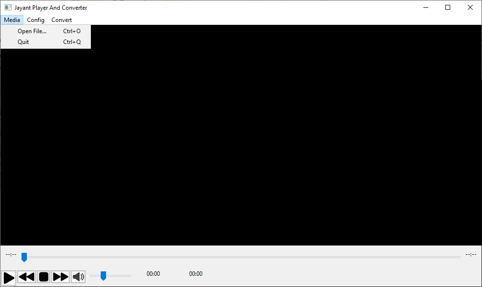
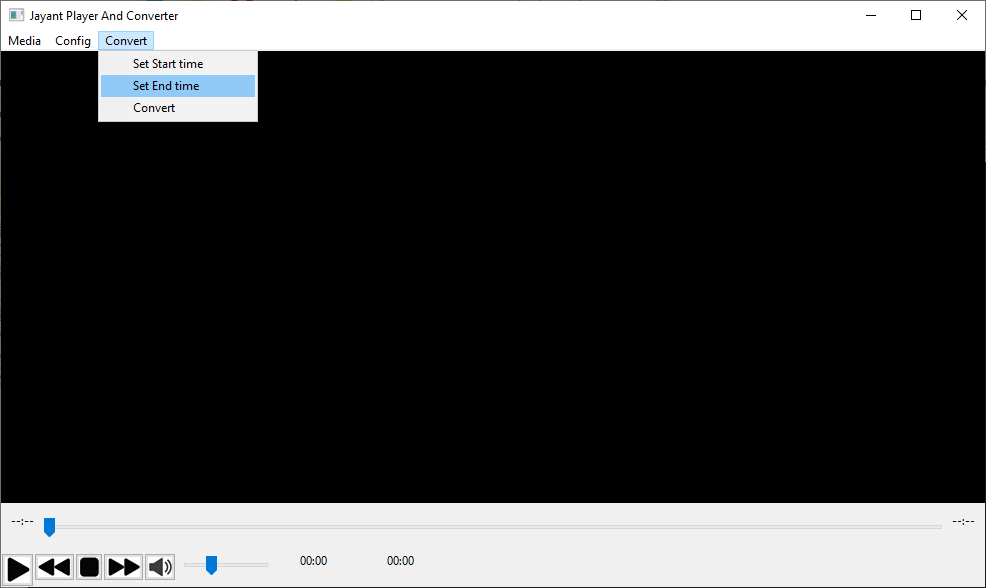
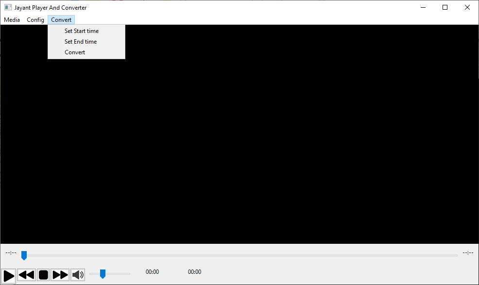

# Video-Player-Python-

# This software is my first wx.media project in wxPython. It's totally inspired from VLC media player. But here I used Python Programming language for backend development. And wxPython for Frontend Gui.

# Install

## pip install moviepy

